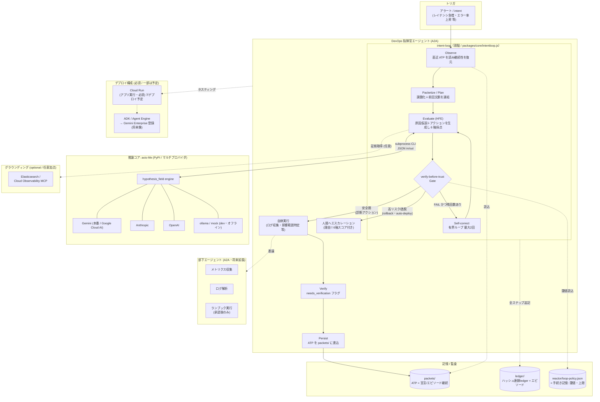
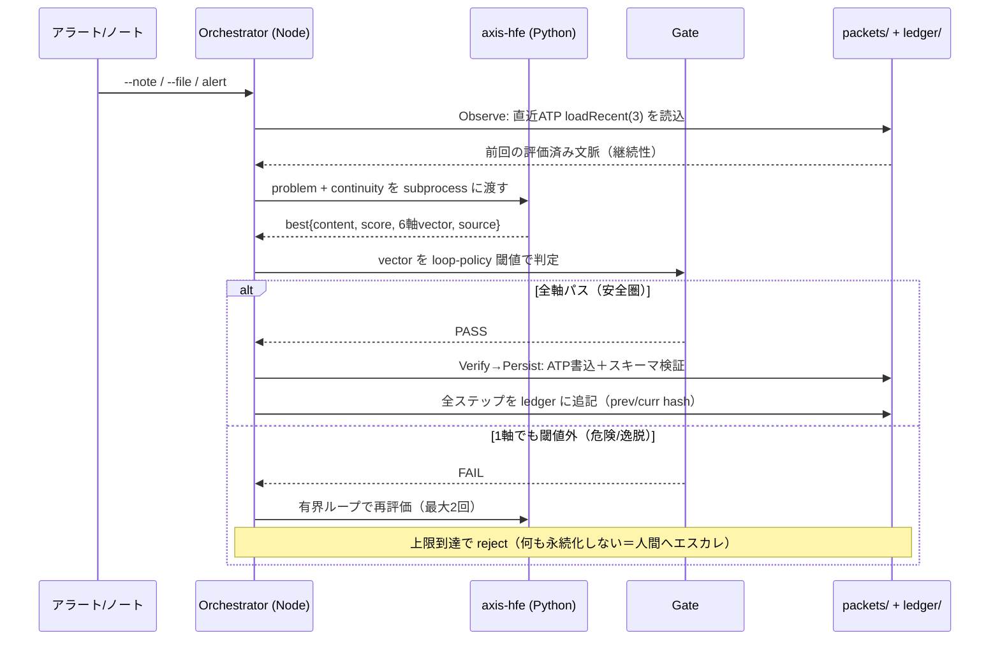

# ARCHITECTURE — intentloop-harness

> **DevOps × AI Agent Hackathon 2026** 提出作品のアーキテクチャ。
> 本書は主に審査基準 **5（実装力: 技術構成の納得度・拡張性・実運用配慮・必須ツール活用）** と
> **3（ユーザビリティの裏側＝判断が説明可能であること）** を取りに行く。
> 記述はリポジトリ実体（`packages/core/`, `python/hfe_score.py`, `reactor/loop-policy.json`,
> `scripts/calibrate.js` など）に準拠する。未実装の項目は「予定 / 構成」と明示する。

---

## 1. 全体像（指揮官 + 部下、頭脳としての intent-loop）



**読み方の要点:**

- ループ本体（Observe → … → Persist）は `packages/core/intentloop.js` が回す。継承元 intentops-harness のパイプライン骨格をそのまま使う。
- **Gate が分岐の主役**。高リスク/逸脱は人間へ、安全圏だけ自律実行。これが verify-before-trust。
- 推論は `axis-hfe`（import 名 `hypothesis_field`）に**サブプロセス CLI**で委譲。マルチプロバイダなので本番は **Gemini（= Google Cloud AI 技術・必須要件達成）**、dev は mock/ollama でコストゼロ。
- 記憶は 3 系統に直交分割（後述）。閾値は `reactor/loop-policy.json` から読み、コードにハードコードしない。

---

## 2. 実際のリポ構成（実体に準拠）

```
intentloop-harness/
├── bin/
│   └── intentloop.js          # CLI: --note / --file / --provider を受けて runLoop を起動
├── packages/core/
│   ├── intentloop.js          # オーケストレータ。Observe→…→Persist の有界ループ本体
│   ├── hfe.js                 # Wire #1: Node→Python ブリッジ（spawn, JSON in/out）
│   ├── gate.js                # verify-before-trust ゲート。閾値は loop-policy から読込
│   ├── packetize.js           # Wire #2: ATP 生成＋スキーマ検証＋永続化＋直近ATP読込
│   ├── ledger.js              # ハッシュ連鎖ledger（継承）
│   └── schema-validate.js     # ATP のスキーマ検証
├── python/
│   ├── hfe_score.py           # axis-hfe ラッパ（JSON in/out, mock_llm 対応）
│   └── requirements.txt       # axis-hfe[anthropic] 等
├── schema/
│   └── thought-packet.schema.json   # ATP スキーマ（draft-07, 6軸 vector を必須化）
├── reactor/
│   └── loop-policy.json       # 手続き記憶: gate 閾値 / loop 上限 / hfe preset・provider
├── notes/                     # 較正用の実ノート5本（先頭に human_quality ラベル）
├── packets/                   # 実行時 ATP 出力（.gitignore / ランタイム）
├── ledger/
│   ├── ledger.jsonl           # ハッシュ連鎖の本体
│   └── calibration-*.md       # HFE vs 人間 の較正ログ（EVAL.md が参照）
├── scripts/
│   ├── calibrate.js           # DoD #6: 5ノート較正。--runs N で多数回平均モード
│   ├── selftest.js            # スモークテスト
│   └── test-calibrate-stats.js# 平均/標準偏差ユーティリティの単体テスト
└── docs/
    ├── BUILD_BRIEF.md         # 権威スペック
    ├── RUN_CALIBRATION.md     # 本物 axis-hfe で較正を回す手順
    └── hackathon/             # ← 本提出パッケージ（STORY / ARCHITECTURE / EVAL）
```

**2 本の配線（この作品の実装上の肝）:**

1. **Wire #1 — JS 採点 → 本物の axis-hfe。** `packages/core/hfe.js` が `python/hfe_score.py` を `spawn` し、`{ problem, ideal_preset, iterations, count, provider, model }` を stdin に渡して `{ best, ranked, ... }` を stdout で受ける。HFE は**品質ゲート / ロジック整理器**として使い、自律的な答え生成エンジンとして過信しない。
2. **Wire #2 — 使い捨て出力 → ATP 永続化。** `packetize.js` がゲート通過結果をスキーマ検証付きで `packets/<id>.json` に書く。次セッションの Observe（`loadRecent(3)`）が直近 ATP を読み「思考の続き」から再開する。

---

## 3. データフロー（note/alert → 6 軸 → ゲート → ATP → 継続）



**ゲート判定（`gate.js` / 閾値は `reactor/loop-policy.json`）:**

通過には**全条件**を満たす必要がある（ハード条件）。

```
risk        <= 0.40     かつ
consistency >= 0.70     かつ
accuracy    >= 0.80     かつ
divergence  <= 0.47     # ポリシーに定義があり、かつベクトルに軸がある時のみ適用
```

`divergence_max` は後方互換のため「ポリシーに定義があり、かつベクトルが軸を持つ場合のみ」適用する設計（古いポリシーや mock ベクトルでも壊れない）。**この 4 軸目を入れた経緯と、その妥当性の限界は `EVAL.md` で実データとともに検証している。**

**ATP（AxisThoughtPacket）の実形:** `id / schema_version / created_at / session_id / intent / content / source_note / hfe{score, vector(6軸), source, iterations_run, preset} / gate{passed, thresholds, reasons} / needs_verification / lineage{prev_packet_ids}`。`lineage.prev_packet_ids` が継続性のリンクを張る。`source` が `fused/jumped/self_corrected` の時は `needs_verification: true`（verify-before-trust）。

---

## 4. 技術スタック × 必須ツール 対応表（基準 5 用）

| レイヤ | 採用技術 | 役割 | ハッカソン要件との対応 |
| --- | --- | --- | --- |
| オーケストレーション | **Node.js (>=18, 標準モジュールのみ・ランタイム依存ゼロ)** | ループ骨格・ゲート・ATP・ledger | 拡張性: 依存ゼロで可搬性が高い |
| 推論コア | **axis-hfe（PyPI公開 / import名 `hypothesis_field`）** | 6 軸 HFE 採点。マルチプロバイダ | 自作ライブラリで実装力を示す |
| AI プロバイダ（本番） | **Gemini（gemini-2.5-flash）** via axis-hfe | 仮説生成・採点 | **必須: Google Cloud AI 技術 → 達成済み** |
| AI プロバイダ（dev） | mock / ollama | オフライン・コストゼロ開発 | 実運用配慮: コスト制御 |
| AI プロバイダ（代替） | Anthropic（claude-sonnet-4-6）/ OpenAI（gpt-4o） | プロバイダ非依存性の担保 | 拡張性: ベンダロックイン回避 |
| 永続化 / 記憶 | `packets/`（ATP）, `ledger/`（ハッシュ連鎖）, `reactor/`（ポリシー） | 3 系統の直交記憶 | 実運用配慮: 監査可能性 |
| スキーマ | JSON Schema draft-07 | ATP の構造保証 | 実運用配慮: データ契約 |
| デプロイ | **Cloud Run** | アプリ実行ホスティング | **必須: GCP アプリ実行プロダクト →（後述）デプロイ予定/構成** |
| グラウンディング | **Elasticsearch / Cloud Observability MCP** | 証拠取得（任意） | **任意加点: Elastic 利用 →（後述）構成として用意** |
| エージェント基盤 | ADK / Agent Engine → Gemini Enterprise 登録 | A2A・本番運用（将来像） | 拡張性: 部下エージェント束ね |

---

## 5. デプロイ構成（必須要件の現状を正直に）

ハッカソンの必須要件と、本作の**現状**を区別して記す。誇張しない。

- **必須: Google Cloud のアプリ実行プロダクトにデプロイ** → **未実施。** 現状は CLI（`bin/intentloop.js`）と較正スクリプトでローカル実行・検証済み。提出にあたっては **Cloud Run へのデプロイを予定**しており、構成は以下を想定:
  - Node オーケストレータ + Python（axis-hfe）を 1 コンテナに同梱（`hfe.js` が `python` を spawn する現設計をそのままコンテナ内で満たす）。
  - `ANTHROPIC_API_KEY` / Gemini 認証は Secret Manager 経由で注入（現状はセッション環境変数。`.env` は `.gitignore` 済み）。
  - アラート Webhook → Cloud Run エンドポイント → `runLoop` 起動、の HTTP 化が次の実装ステップ。
- **必須: Google Cloud AI 技術** → **達成済み。** 本番 run は axis-hfe 経由で **Gemini（gemini-2.5-flash）** を使用。較正ログ `ledger/calibration-*.md`（`provider: gemini`）が実行実績。
- **任意/加点: Elasticsearch グラウンディング** → **構成として用意（接続は今後）。** Evaluate ステップが証拠取得のために Elastic / Cloud Observability MCP を呼ぶ口を設計済み。インシデントの実ログ・メトリクスを HFE の入力文脈に注入することで、採点の `accuracy` を実データに接地させるのが狙い。
- **将来像: ADK / Agent Engine → Gemini Enterprise 登録。** 指揮官エージェントを Agent Engine に載せ、A2A で部下エージェント（メトリクス収集・ログ解析・承認後のランブック実行）を束ねる構成へ拡張する。

> 取りに行く基準: **5（実運用配慮・拡張性・必須ツール活用）**。未了項目を「予定/構成」と明示することで、実装の現在地を誠実に示す。

---

## 6. ガードレール（loop engineering / 基準 5 の実運用配慮）

- **有界ループ** —— `loop.max_iterations = 2`。無限リトライによる発振・トークンコスト爆発を構造的に防ぐ。
- **イベント駆動の再評価** —— 再 HFE は「新しいリンク証拠が来た時」だけ。タイマー駆動は禁止（コスト ~4x/~15x の暴発を回避）。
- **observability** —— 全ステップを `ledger.jsonl` に prev/curr ハッシュ付きで追記。`npm run verify-ledger` で連鎖の整合を検証できる。
- **verify-before-trust** —— fused/jumped/self_corrected 出力は `needs_verification: true` を立て、検証前は確定記憶にしない。
- **安全** —— パケットに秘密情報を入れない / 自動 deploy・自動 push は禁止（Consent Gate 継承）。

---

## 7. 記憶モデル（直交を保つ / 設計の一貫性）

| 種別 | 知の型 | 置き場 | 実体 |
| --- | --- | --- | --- |
| 宣言的記憶 | 知っている（that） | 3 層データ + RAG → `packets/` の ATP content | 評価済みの意味 |
| 手続き記憶 | やり方（how） | `reactor/loop-policy.json` | 閾値・反復上限・preset・provider |
| エピソード記憶 | 何が起きたか | `ledger/`（ledger.jsonl + calibration ログ） | ハッシュ連鎖の足跡 |

ATP がこれらの間を運ぶ媒体、MCP はアクセスのバス（プロトコルであってデータ層ではない）。この直交性を崩さないことが、拡張時にゲート方針（手続き）と過去判断（エピソード）と知識（宣言）を独立に更新できる根拠になる。

> 取りに行く基準: **5（技術構成の納得度・拡張性）**
